### Updates 
Contributions:
Myself (Nicholas Ganeshram) created the student side of QCfirst and login Page, while Shohum created the Instructor side. I also attached a portion of my CSS file, which I'am currently working on. 

# qcfirst
Creating a CunyFirst for Queens College
## Below are Our Features for our Queens College CunyFirst WebPage
-Allows access to both students and instructors  
  -Students are allowed to view their current enrolled courses, enroll in upcoming Courses and drop current courses. 
  -Teachers are allowed to create and delete courses. 
  -Students and teachers have limited access based on there roles. 
  -We plan on having a responsive web design to fit tablets, desktop and mobile applications. 
  
  ### Below are our planned Visual Designs of our website.
   
#### Mobile Login Page
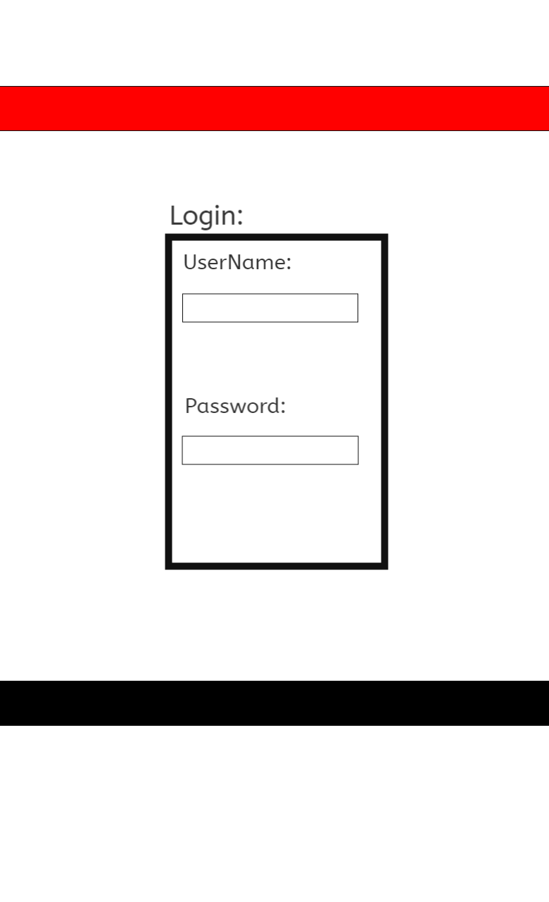

#### Desktop Login Page
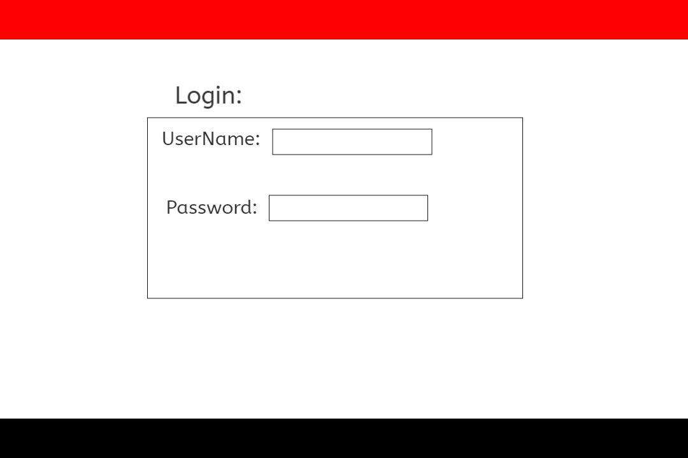

#### Mobile HomePage
  
  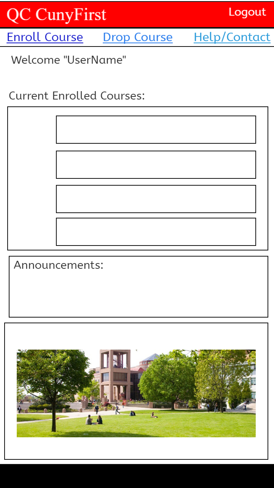

   #### Desktop HomePage
  
  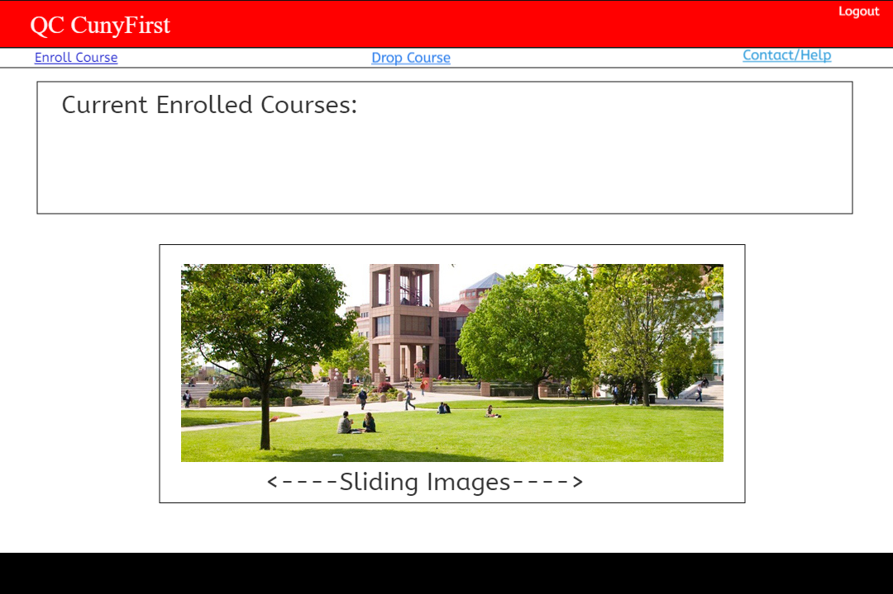
  
  
   #### Mobile Enrollment Course Page
   
   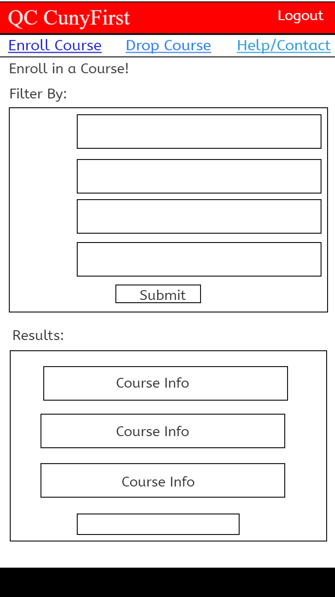

  #### Desktop Enrollment Course Page
  
  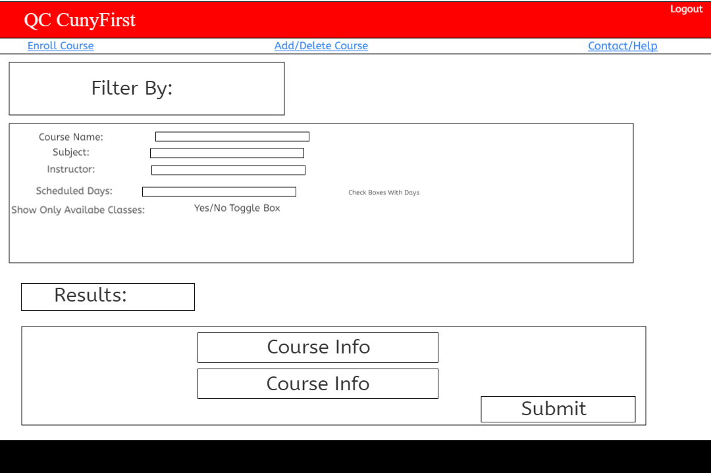
  
  #### Mobile Drop Course Page

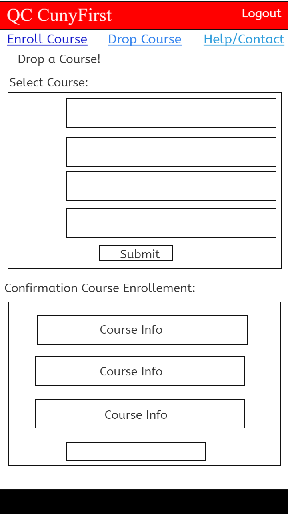

#### Desktop Drop Course Page

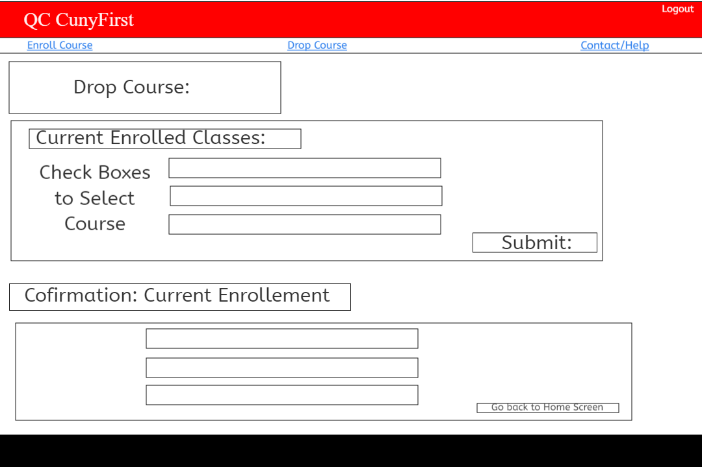

#### Mobile Contact/Help Page

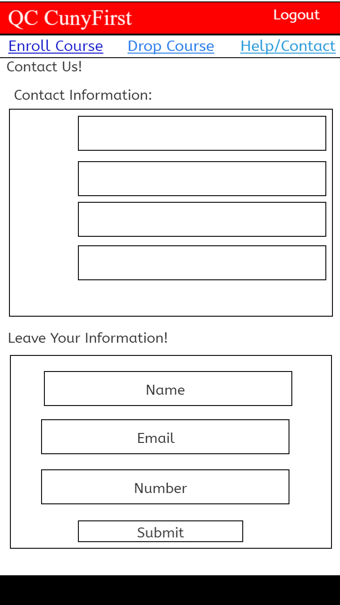

#### Desktop Contact/Help Page

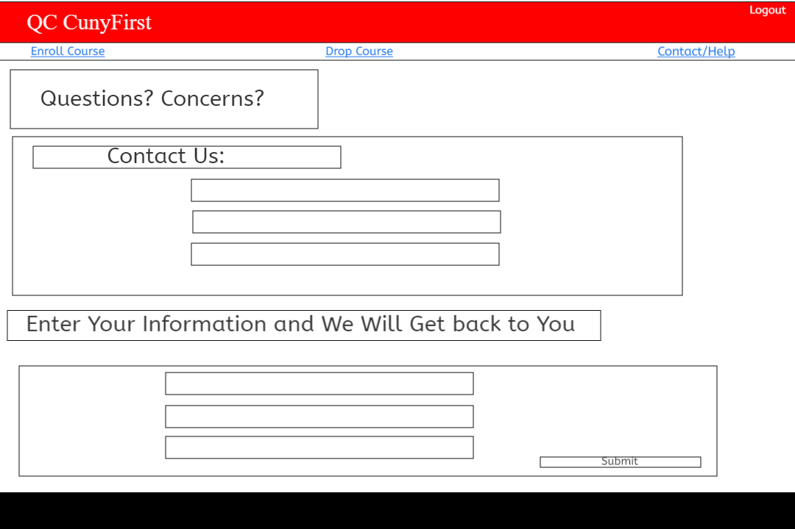

## Instructor WebPage

### Mobile Home Page

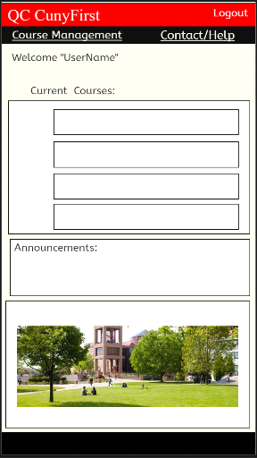

### Desktop Home Page

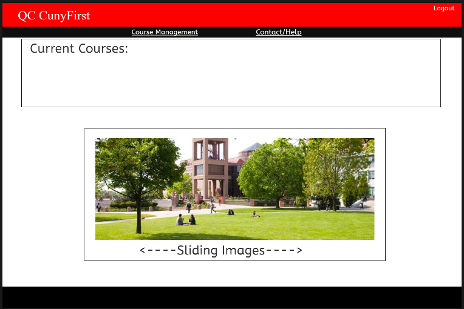

### Mobile Course Mangement  Page

### Desktop Course Mangement  Page

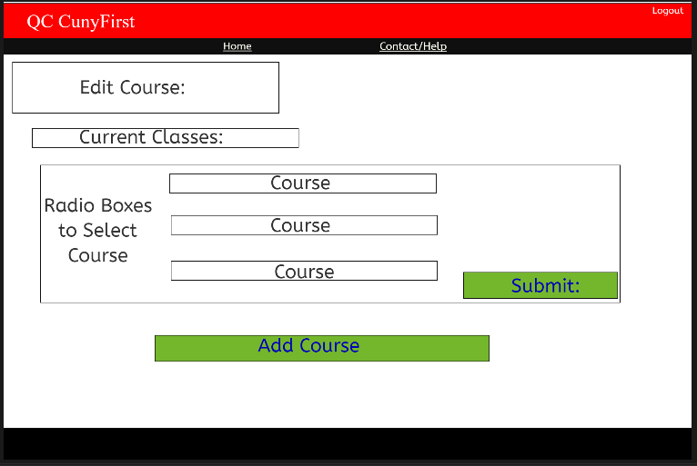

### Mobile Add Course  Page

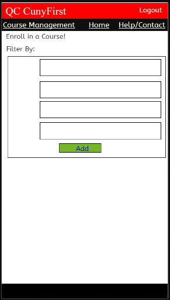

### Desktop Add Course  Page

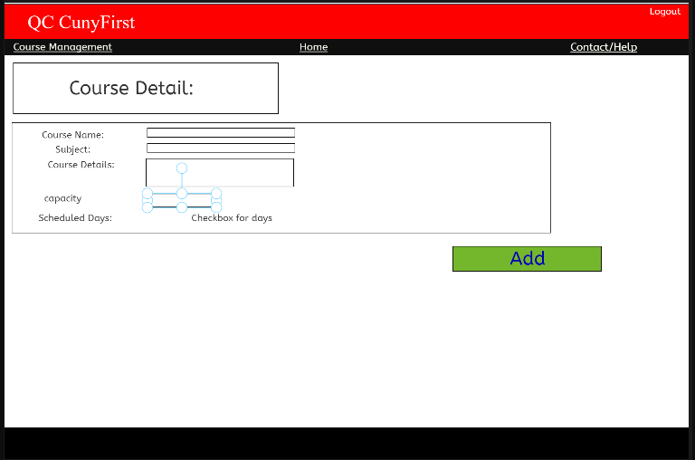

### Mobile Edit Course  Page

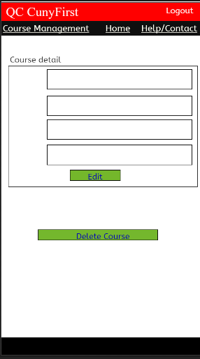

### Desktop Edit Course  Page

### Mobile Contact Us  Page

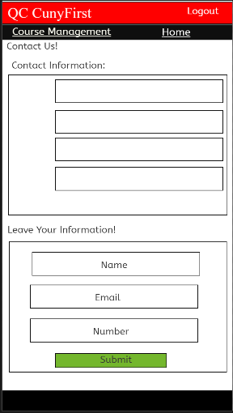

### Desktop Contact Us  Page

