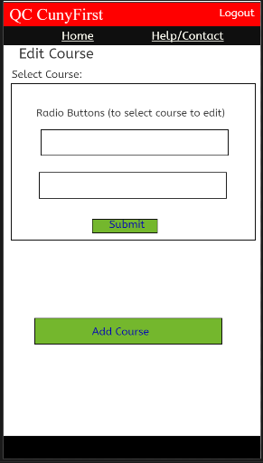
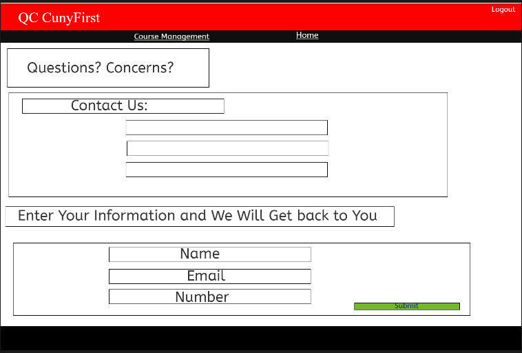

# qcfirst
Creating a CunyFirst for Queens College
## Below are Our Features for our Queens College CunyFirst WebPage
-Allows access to both students and instructors  
  -Students are allowed to view their current enrolled courses, enroll in upcoming Courses and drop current courses. 
  -Teachers are allowed to create and delete courses. 
  -Students and teachers have limited access based on there roles. 
  -We plan on having a responsive web design to fit tablets, desktop and mobile applications. 
  
  ### Below are our planned Visual Designs of our website.
   
  #### Mobile HomePage
  
  

   #### Desktop HomePage
  
  
  
  
   #### Mobile Enrollment Course Page
   
   

  #### Desktop Enrollment Course Page
  
  
  
  #### Mobile Drop Course Page

#### Desktop Drop Course Page

#### Mobile Contact/Help Page

#### Desktop Contact/Help Page

## Instructor WebPage

### Mobile Home Page

### Desktop Home Page

### Mobile Course Mangement Home Page

### Desktop Course Mangement Home Page

### Mobile Add Course Home Page

### Desktop Add Course Home Page

### Mobile Edit Course Home Page

### Desktop Edit Course Home Page

### Mobile Contact Us Course Home Page

### Desktop Contact Us Course Home Page

